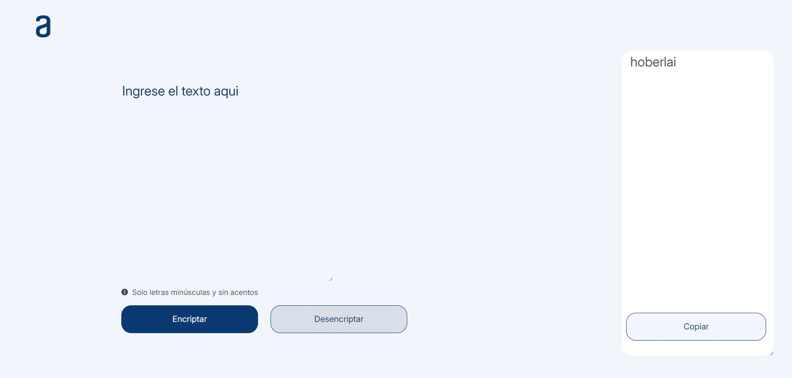

# Challenge Encriptador de Textos Oracle Next Education

## Descripción

Este es un encriptador de textos que permite a los usuarios encriptar y desencriptar mensajes. El proyecto fue desarrollado como parte del Challenge Encriptador de Texto del curso "Practicando lógica de programación" del programa Oracle Next Education.

## Características Principales

- **Cifrado de texto en tiempo real:** Ingresa el texto y observa cómo se encripta instantáneamente.
- **Descifrado de texto:** Recupera el texto original a partir del mensaje encriptado.
- **Interfaz intuitiva:** Diseño sencillo y fácil de usar para una experiencia óptima.

## Tecnologías Utilizadas

- **HTML5:** Para la estructura del sitio web.
- **CSS:** Para el estilo y la apariencia de la interfaz.
- **JavaScript:** Para la lógica de encriptación y desencriptación.

## Instrucciones de Instalación

Para ejecutar este proyecto localmente, sigue los siguientes pasos:

1. Clona el repositorio:
   ```bash
   git clone https://github.com/KeVO-99/challenge-encriptador-textos.git

2. Navega al directorio del proyecto.

3. Abre el archivo index.html en tu navegador. 

## Instrucciones de Uso

1. Encriptar Texto:
* Ingresa el texto que deseas encriptar en el área de texto.
* El texto encriptado aparecerá en tiempo real en el área de resultados.

2. Desencriptar Texto:
* Pega el texto encriptado en el área correspondiente.
* El mensaje original se mostrará en el área de salida.

## Documentación

Las "llaves" de encriptación utilizadas son las siguientes:

* La letra "e" se convierte en "enter".
* La letra "i" se convierte en "imes".
* La letra "a" se convierte en "ai".
* La letra "o" se convierte en "ober".
* La letra "u" se convierte en "ufat".





## Licencia

Este proyecto no está publicado bajo ninguna licencia pública. Todos los derechos están reservados y el uso del código está restringido.

## Contacto

Si tienes alguna pregunta o deseas contactarme, puedes hacerlo a través de:

* LinkedIn: www.linkedin.com/in/kevo-dev
* GitHub: KeVO-99